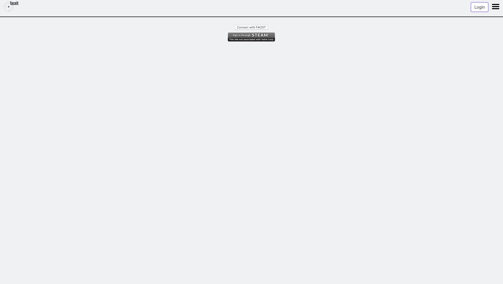

# faceit-dashboard
Project scope:
https://docs.google.com/document/d/1p1qc_U-KFX6IqyKMmMTsbVo78aznNfLPhrvPueTVBVI/edit?usp=sharing
## Project setup
```
npm install
```

### Compiles and hot-reloads for development
```
npm run serve
```

### Compiles and minifies for production
```
npm run build
```

### Lints and fixes files
```
npm run lint
```

### Starts both backend and frontend servers locally for developmement
```
npm run dev
```

### Interactive application designs

https://www.figma.com/proto/SBdoD1dD8Pf124762pZQc4/Product-Design-Kit-1.0-by-Mateusz-Wierzbicki?node-id=483%3A802&scaling=min-zoom

Designs created in figma. These are prototypes for how the app was supposed to look like. They are fully interactive and user can click through the app before the app is even created. We created those first as guidelines later when we were developing the app.


### Login flows in application


#### There are two ways for user to login

1.Using faceit api

    - User is redirected to facte it website
    - After succesfull authetication user is redirected back to the website

2.Using Steam api

    -  User is redirected to steam api by cutom backend server
    -  After succesfull authetication user is redirected back to backend server, which created a cookie and redirects user back to the SPA frontend application with the cookie.


After one of the above methods is used requests to the api can be made on behalf of the user.


### Application funcationalities


#### Player screen - displays important player statistics, his last matches and charts with maps played





#### Login screen - Displays to buttons that redirect user to proper authentication websites (steam/faceit)


#### Players screen - Displays top ten players, and allows user to search for players that he wants to compare with.

